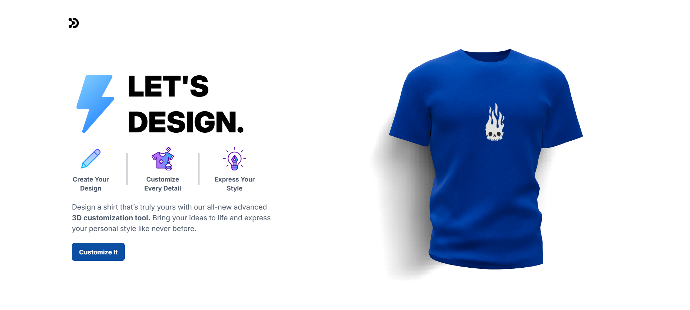

# 3D T-Shirt Customizer



An interactive 3D t-shirt customization app powered by React, Three.js, and AI image generation via Cloudflare Workers AI.

## Features

- 3D real-time t-shirt preview using Three.js / React Three Fiber
- Apply custom colors, logo decals, or full-shirt textures
- Upload your own images as decals
- Generate AI textures using Cloudflare Stable Diffusion XL
- Download your customized design
- Smooth animations with Framer Motion

## Tech Stack

**Frontend:** React 19, Vite, Three.js, @react-three/fiber, @react-three/drei, Tailwind CSS, Framer Motion, Valtio

**Backend:** Node.js, Express, Cloudflare Workers AI (Stable Diffusion XL), OpenAI SDK

## Getting Started

### Prerequisites

- Node.js 18+
- Cloudflare account with Workers AI enabled
- OpenAI API key (optional)

### Installation

1. Clone the repository

2. Install server dependencies:
   ```bash
   cd server
   npm install
   ```

3. Install client dependencies:
   ```bash
   cd Client
   npm install
   ```

4. Configure environment variables:

   **`server/.env`**
   ```
   PORT=3000
   OPENAI_API_KEY=<your_openai_api_key>
   CF_ACCOUNT_ID=<your_cloudflare_account_id>
   CF_API_TOKEN=<your_cloudflare_api_token>
   ```

   **`Client/.env.local`**
   ```
   VITE_BACKEND_URL=http://localhost:<PORT NO.>
   ```

### Running the App

Start the backend:
```bash
cd server
npm start
```

Start the frontend:
```bash
cd Client
npm run dev
```

Open [http://localhost:<PORT NO.>](http://localhost:<PORT No.>) in your browser.

## Project Structure

```
├── Client/          # React frontend
│   └── src/
│       ├── canvas/      # Three.js scene (Shirt, Backdrop, CameraRig)
│       ├── components/  # UI components (AiPicker, ColourPicker, FilePicker, etc.)
│       ├── pages/       # Home & Customizer pages
│       ├── config/      # Constants, helpers, animations
│       └── strore/      # Valtio global state
└── server/          # Express backend
    └── routes/      # DALL·E / AI image generation route
```
